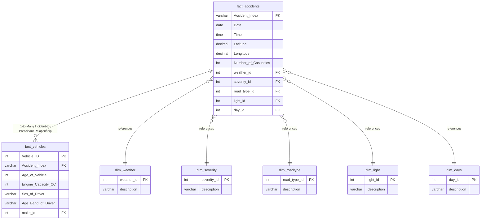

# 📄 UK Road Safety Data Pipeline & Analytics Documentation

---

## Section 1: Project Planning

### 1.1. Project Charter

The UK Road Safety Data Pipeline project is engineered to ingest, model, transform, and visualize large-scale historical traffic accident records. By replacing non-relational flat-file processes with a structured relational database architecture, the system provides reliable, data-backed trends to support municipal safety interventions.

| **Element** | **Description** |
| --- | --- |
| **Project Title** | UK Road Safety: Time, Environment & Infrastructure Trends Analysis

 |
| **Objective** | Design an end-to-end relational data pipeline and interactive BI dashboard analyzing police-reported traffic incidents to optimize safety interventions.

 |
| **Sponsor** | Digital Egypt Pioneers Initiative (DEPI) Scholarship Program

 |
| **Core Team** | 1. Abdallah Ahmed (Data Engineering & Pipeline Architecture)<br>

<br>2. Yousef Elhwehy (BI Development & Visualization)<br>

<br>3. Basel Mohamed (Data Quality & Quality Assurance)<br>

<br>4. Moaz Elkersh (Analytics & Insights Verification)

 |

---

### 1.2. Scope Definition

#### ✅ In-Scope

* **Database Engineering:** Transitioning flat CSV files into a multi-table relational Star Schema inside a PostgreSQL environment.


* **Data Integrity & Preprocessing:** Formatting datetime parameters, cleaning missing records, and enforcing explicit strict constraints (Primary and Foreign keys).


* **Analytical Metric Development:** Constructing centralized business intelligence calculations including Fatality Rates, Casualty Rates, and Temporal Trends.


* **Interactive Dashboard Design:** Delivering a 3-page interactive dashboard with cross-filtering components across time, environment, and geography.


#### ❌ Out-of-Scope

* Real-time live streaming infrastructure or real-time roadside sensor integrations.
* Predictive machine learning forecasting models for accident occurrences.
* Public-facing client notification web applications.

---

### 1.3. Methodology & Agile Sprint Plan

* **Sprint 1 (Week 1): Schema Modeling & ETL Architecture**
* Deconstruct raw source datasets into structured entity granularities (Incident vs. Participant levels).


* Initialize database environments with strict typing (`DECIMAL`, `SERIAL`, explicit relational constraints).


* **Sprint 2 (Week 2): Data Quality Isolation & Imputation**
* Execute exploratory aggregate queries within the database engine to check distribution parameters.


* Isolate missing data features (`Age_of_Vehicle`, `Engine_Capacity_.CC.`) and run cleaning and validation queries to ensure zero-NULL fields.


* **Sprint 3 (Week 3): Analytical Modeling & Aggregation**
* Generate centralized dimensional data summaries and calculate KPI matrix factors.


* Perform multi-dimensional correlation matrix analyses matching environmental factors with infrastructure categories.


* **Sprint 4 (Week 4): BI Visualization & Front-End Delivery**
* Map data layers to an optimized visual system layout across 3 dedicated interactive views.


* Implement user parameters, cross-filtering matrices, and complete performance testing.


---

### 1.4. Risk Management

* **Risk 1: Performance Degradation From Massive Row Counts**
* *Description:* Query execution delays during multi-table joins over millions of source rows.


* *Mitigation:* Utilize optimized database structures (Star Schema) and indexing strategies on Foreign Key references to boost performance in high-volume environments.


* **Risk 2: Invalid Data Quality Fields in Historical Attributes**
* *Description:* Null entries or unaligned fields (`Age_of_Vehicle`, `Engine_Capacity_.CC.`) skewing statistical averages.


* *Mitigation:* Implement verification constraints and validation scripts inside PostgreSQL to check conditions before dashboard ingestion.


* **Risk 3: Ineffective UI Layer From Layout Crowding**
* *Description:* Misaligned visual hierarchies making critical insights difficult to scannably extract.


* *Mitigation:* Divide front-end systems into three distinct analytical categories using clean card containers and a unified color scheme.


---

## Section 2: Stakeholder Analysis

### 2.1. Stakeholder Register

| **Stakeholder Class** | **Functional Role** | **Core Analytics Need** | **Influence / Interest** |
| --- | --- | --- | --- |
| **Municipal Engineers** | Primary End-User | Pinpoint high-risk infrastructure combinations (e.g., Single Carriageways under rainy conditions).

 | High / High |
| **Emergency Services** | Operations Planner | Evaluate temporal charts to optimize regional team deployment during peak rush hours.

 | High / Medium |
| **Civic Committees** | Safety Auditor | Monitor macro performance indicators (Fatality Rates, Casualty Densities) over time.

 | Medium / High |
| **Core Dev Team** | Data Architects | Build scalable database structures preventing update anomalies and processing lag.

 | High / High |

---

### 2.2. User Personas

#### 👤 Persona 1: Marcus – Infrastructure Engineer (Municipal Planning)

* **Demographics:** 44 years old, Civil Engineer specializing in urban road infrastructure safety layout.
* **Context:** Requires a reliable view of how specific road geometries (Roundabouts vs. Single Carriageways) perform under environmental stresses.


* **Pain Points:** Flat-file reports mask complex interactions, making it hard to see if weather or road design is the primary factor.


* **Dashboard Requirement:** Interactive Environmental Risk Matrix and Infrastructure Breakdown charts.


#### 👤 Persona 2: Chief Inspector Davies – Emergency Response Coordinator

* **Demographics:** 51 years old, Traffic Command and emergency responder resource manager.
* **Context:** Tasked with scheduling patrols and managing localized accident responses.
* **Pain Points:** Unpredictable spikes in daily accident numbers create major staffing bottlenecks.


* **Dashboard Requirement:** Temporal Trends component displaying precise hourly distribution peaks and weekday-to-weekend patterns.


---

### 2.3. Requirements Mapping

> * **Analytical Goal:** Isolate high-risk crash factors to guide proactive municipal intervention.
> * **Technical Solution:** Build dynamic interactive charts matching road classification with weather characteristics.
> 
> 
> * **Actionable Impact:** Pinpoints the precise combination where accidents spike—such as Single Carriageway segments under rainy parameters—enabling engineers to target structural re-pavement projects exactly where they are needed most.
> 
> 
> 
> 

---

## Section 3: Database Design (Data Model)

### 3.1. Conceptual Model

The system architecture transitions away from a single tabular format ("flat file") to eliminate data redundancy and prevent update anomalies. The data design separates structural facts into two granular transactional entities—**Incident Level Details** (unique accident events) and **Participant Level Attributes** (individual vehicles and driver specifications)—linked to localized dimensional features through a One-to-Many relational network.

---

### 3.2. Logical Data Dictionary

#### `fact_accidents` (Core Transaction Table)

Tracks the primary physical data points recorded for each collision event.

| Field Name | Data Type | Key Type | Transformation/Business Logic | Quality Flag |
| --- | --- | --- | --- | --- |
| `Accident_Index` | `VARCHAR` | Primary Key | Extracted as the alphanumeric unique event tracking index from source data.

 | High (100% Unique) |
| `Date` | `DATE` | Attribute | Converted string formatting into optimized system date notation.

 | High |
| `Time` | `TIME` | Attribute | Isolated hourly temporal strings into clean time tracking metrics.

 | High |
| `Latitude` | `DECIMAL(10,8)` | Attribute | Precision typed decimal for high-accuracy geographical mapping.

 | High |
| `Longitude` | `DECIMAL(11,8)` | Attribute | Precision typed decimal for high-accuracy geographical mapping.

 | High |
| `Number_of_Casualties` | `INTEGER` | Metric | Extracted directly; used for rolling aggregation totals across charts.

 | High |
| `weather_id` | `INTEGER` | Foreign Key | Linked to `dim_weather` to normalize environmental variables.

 | High (0% Nulls Post-ETL) |
| `severity_id` | `INTEGER` | Foreign Key | Linked to `dim_severity` to evaluate event impact tiers.

 | High (0% Nulls Post-ETL) |
| `road_type_id` | `INTEGER` | Foreign Key | Linked to `dim_roadtype` to track physical infrastructure setup.

 | High (0% Nulls Post-ETL) |

#### `fact_vehicles` (Participant Table)

Tracks explicit vehicle profiles and driver demographics involved in the respective accident instances.

| Field Name | Data Type | Key Type | Transformation/Business Logic | Quality Flag |
| --- | --- | --- | --- | --- |
| `Vehicle_ID` | `SERIAL` | Primary Key | Auto-incrementing index isolating unique vehicle participant records.

 | High (System Generated) |
| `Accident_Index` | `VARCHAR` | Foreign Key | Connects multiple vehicle records back to a single accident incident.

 | High (Relational Join) |
| `Age_of_Vehicle` | `INTEGER` | Attribute | Validated using conditional SQL structures to impute structural missing flags to `0`.

 | Validated (Zero Nulls) |
| `Engine_Capacity_.CC.` | `INTEGER` | Attribute | Standardized engine data; handled missing values directly in PostgreSQL.

 | Validated (Zero Nulls) |
| `Sex_of_Driver` | `VARCHAR` | Attribute | Cleaned categorical string tracking gender breakdowns.

 | High |
| `Age_Band_of_Driver` | `VARCHAR` | Attribute | Categorized age fields into group brackets for scannable visualization.

 | High |

---

### 3.3. Data Relationships (Star Schema)

The database architecture runs a highly optimized **Star Schema** designed to drive dashboard performance and eliminate processing overhead during cross-filtering interactions.



---

## Section 4: UI/UX Design (Dashboard Blueprint)

### 4.1. Dashboard Theme & Color Palette

The business intelligence dashboard applies a clean color scheme built for maximum analytical scanning and fast insight extraction.

* **Background Canvas:** Light Slate Gray background to optimize contrast and reduce eye strain over extended review periods.


* **Visual Container Tiers:** Crisp white card blocks with rounded corners to establish clear structural boundaries.


* **Primary Action Fill:** Deep Cobalt Blue accent tracking key volumes (`Total Accidents`, `Casualty Counts`).


* **Alert Status Palette:** Multi-colored markers highlighting demographic and gender variances across system visuals.


---

### 4.2. Page Layout & Structure

#### 📊 Page 1: Time & Trends Analysis

* **KPI Banner Matrix:** High-visibility metric cards tracking total accident volumes, casualties, fatalities, object collisions, and mass casualty numbers.


* **Hourly Distribution Timeline:** Continuous line area graph highlighting daily commute peaks (8:00 AM & 5:00 PM rush hours).


* **Weekly Breakdown:** Horizontal chart highlighting weekend vs. weekday patterns (identifying Friday as a volume peak).


* **Monthly Seasonal Tracker:** Linear timeline mapping accident trends across seasonal cycles.


#### 🛠️ Page 2: Environment & Infrastructure Analysis

* **Rate Performance Cards:** Displays specific calculated variables like Fatality Rates, Casualty Rates, and yearly averages.


* **Environmental Interaction Matrix:** Cross-tabular heat grid analyzing environmental variables (e.g., Rain, Fog) against road configurations.


* **Infrastructure Ranking:** Clean horizontal chart tracking incident density across road setups (Single Carriageways, Roundabouts, Slip Roads).


* **Visibility Factor Analysis:** Donut chart plotting lighting conditions (Daylight vs. Dark lighting).


#### 📍 Page 3: Road Infrastructure & Geographic Insights

* **Geospatial Map Canvas:** Detailed point mapping showing regional hot spots and high-density accident clusters.


* **Demographic Factor Breakdown:** Demographic population chart analyzing age groups alongside gender parameters.


* **Surface Constraint Tracker:** Volume indicator measuring the impact of dry vs. compromised road surfaces.


---

### 4.3. User Interaction & Cross-Filtering

The dashboard leverages deep relational cross-filtering to streamline user investigation pathways.

```text
[User selects filter option: Severity = "Fatal" + Weather = "Raining"]
                         ↓
[The system passes context down through the Star Schema relationships]
                         ↓
[Dashboard components update automatically across all sheets]
  - KPI Cards: Instantly recalculate fatalities and totals[cite: 1].
  - Time Charts: Pinpoint specific high-fatality hours during wet weather[cite: 1].
  - Map Canvas: Filters out safe areas to display hot spots on high-speed roads[cite: 1].

```

---

## Appendices

### Appendix A: Validation Statements

To guarantee data integrity before dashboard ingestion, clean, validation queries are run within PostgreSQL to ensure all critical records resolve cleanly to zero null values.

```sql
-- Final Data Quality Assurance & Validation Query
SELECT
  (SELECT SUM(CASE WHEN "Age_of_Vehicle" IS NULL THEN 1 ELSE 0 END) FROM public.fact_vehicles) AS missing_age,
  (SELECT SUM(CASE WHEN "Engine_Capacity_.CC." IS NULL THEN 1 ELSE 0 END) FROM public.fact_vehicles) AS missing_engine,
  (SELECT SUM(CASE WHEN "Junction_Control" IS NULL THEN 1 ELSE 0 END) FROM public.fact_accidents) AS missing_junction,
  (SELECT SUM(CASE WHEN "Driver_IMD_Decile" IS NULL THEN 1 ELSE 0 END) FROM public.fact_vehicles) AS missing_driver_imd;

```

---

**Document Version:** 2.4
**Project Group:** Data Pioneers (DEPI R4)
**Architecture Owner:** Abdallah Ahmed
